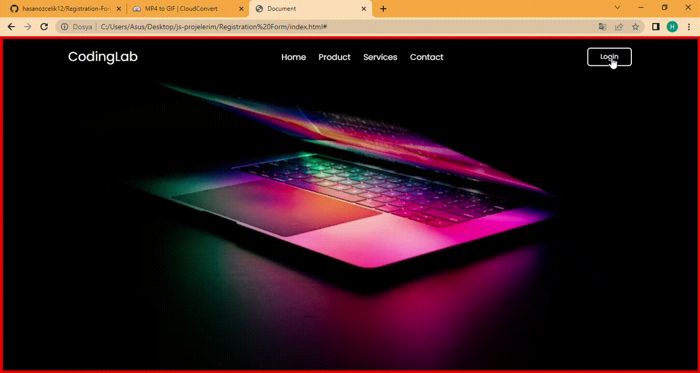

• Two form structures were created using css and html software.
Later, 
by giving these form structures the features of pop-up and seeing the password with javascript,
the project was designed about how we can use two different form structures in one page.

## Screen

